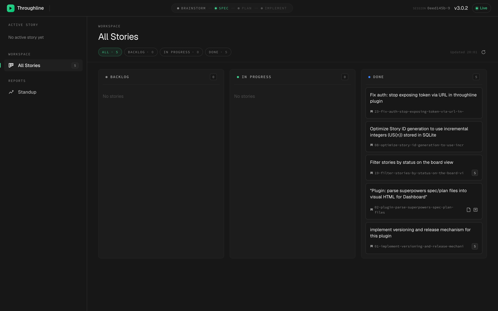
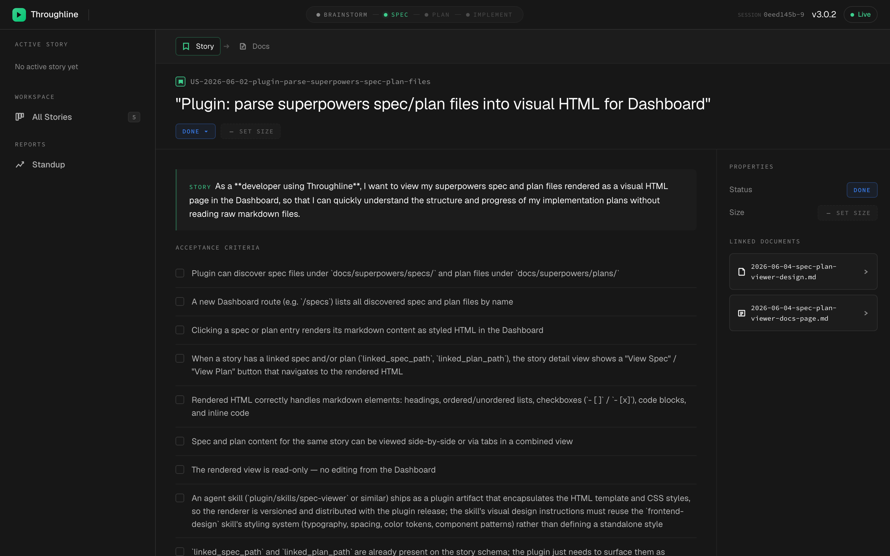
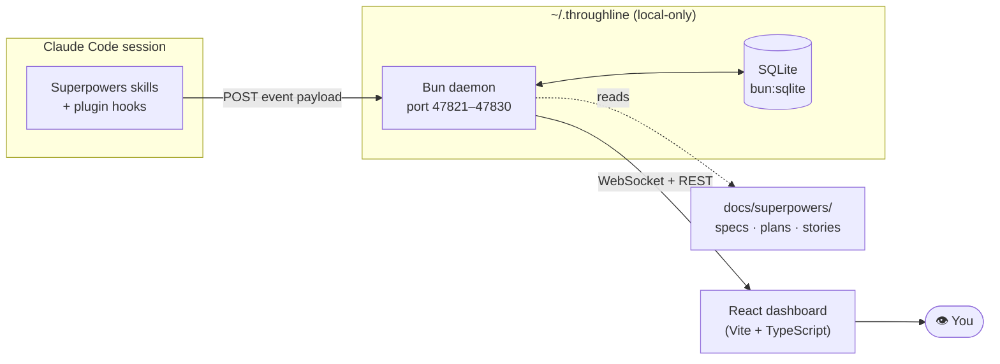
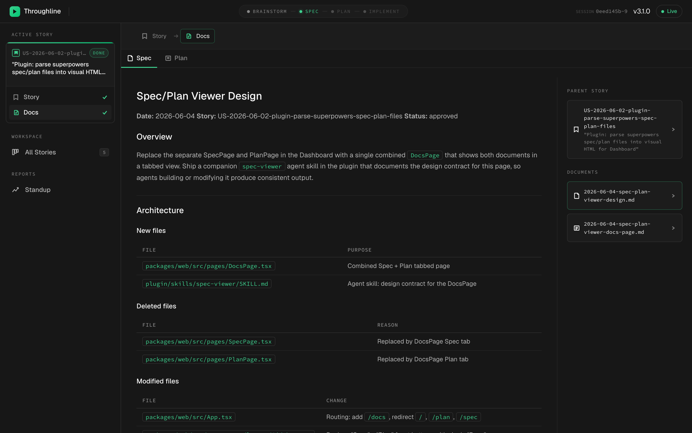
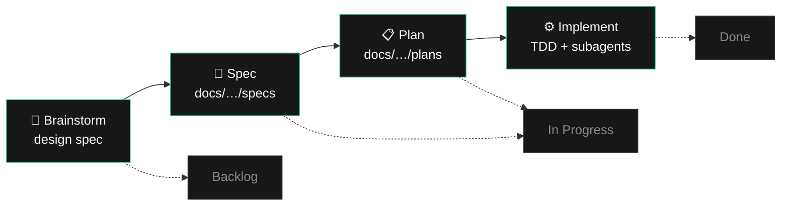

<div align="center">

# ▶ Throughline

### See your Claude Code + Superpowers workflow flow across a live Kanban board.

**brainstorm → spec → plan → implement** — watched, not interrupted.

[](./CHANGELOG.md)
[](#-license)
[](https://bun.sh)
[](https://docs.claude.com/en/docs/claude-code)
[](#-the-observer-only-guarantee)

[Why Throughline](#-why-throughline) · [How it works](#-how-it-works) · [Quick start](#-quick-start) · [Commands](#-command-reference) · [Development](#-development)

<br/>



</div>

---

## What is it?

**Throughline** is a Claude Code plugin that turns the [Superpowers](https://github.com/obra/superpowers) Spec-Driven Development methodology into something you can *watch*. It ships hooks, slash commands, skills, and a local web dashboard that renders your session's workflow in real time — a Kanban board of stories, the live brainstorm → spec → plan → implement lifecycle, plan checkboxes ticking off as the agent works, and the subagent activity that's otherwise invisible in terminal scrollback.

It is a **passive observer**. It records hook events to a local SQLite database and renders them. It never denies a tool call, never blocks stop, never modifies a response. Built for **solo-developer-with-AI flow** — continuous flow over a board, not team Scrum: no sprints, no velocity, no issue-tracker sync.

---

## ✨ Why Throughline

The Superpowers methodology is excellent. The *visibility* into what it's doing is poor — terminal output flies by, subagents run silently, and the only way to check plan progress is to keep refreshing a markdown file. Throughline closes three specific gaps:

- 📊 **Plan progress vs. reality** — Watch a plan's checkboxes tick off live, tied to the tool calls that produced them. No more re-opening `docs/superpowers/plans/*.md` to see where things stand.
- 🌳 **Subagent visibility** — Superpowers dispatches fresh subagents per task; from the terminal that's a few status lines. Throughline surfaces the activity so you can see what's actually happening.
- 🔁 **Resumable solo flow** — User **stories** with **S/M/L sizing** as the input that feeds Superpowers, plus **standup** and **handoff** as lightweight context utilities. Sessions die, work resumes cleanly, handovers stay clean.

<div align="center">

<br/>
<em>Story detail: the user story, acceptance criteria, and linked spec + plan documents — all navigable.</em>
</div>

---

## 🔒 The observer-only guarantee

Throughline is architecturally incapable of getting in your way:

- **Never blocks** tool calls, never blocks stop, never modifies model input or output.
- **Local-first** — everything lives in `~/.throughline` on your machine. Nothing is sent anywhere.
- **Single-user, single-machine** — no accounts, no cloud, no telemetry.

The daemon runs silently in the background. If it isn't running, hooks fail open and your session is unaffected.

---

## 🛠 How it works



On `SessionStart`, a bootstrap hook probes the daemon's health endpoint and spawns it if needed. Every subsequent hook forwards its event payload to the daemon, which records it to SQLite and pushes updates to the dashboard over a WebSocket. The daemon also reads Superpowers' own artifacts (`docs/superpowers/specs/*.md`, `plans/*.md`) so the board pairs live events with real spec/plan content.

<div align="center">

<br/>
<em>Open the active story to read its spec and plan rendered as HTML, right beside the live board — no more refreshing raw markdown.</em>
</div>

---

## 🔄 The lifecycle

Throughline visualizes the Superpowers flow and pairs it with a thin story/board layer:



A **story** (with optional S/M/L size) is the unit of work you move across the board. Its status maps to board columns, while the phase tracker at the top of the dashboard shows where the *active* session sits in the Superpowers lifecycle.

---

## 🚀 Quick start

### 1. Install the plugin

Add a marketplace entry pointing at this repo's curated `dist` branch (bundled server, built dashboard, plugin resources only — no source or dev tooling):

```json
{
  "throughline": {
    "source": { "source": "github", "repo": "chien-tan-kieu/throughline", "ref": "dist" },
    "installLocation": "..."
  }
}
```

Use `"ref": "dist"` to always track the latest release, or pin an exact version with `"ref": "vX.Y.Z"`. List available versions:

```bash
git ls-remote --tags https://github.com/chien-tan-kieu/throughline
```

> **Pairs with [Superpowers](https://github.com/obra/superpowers).** Throughline works standalone as an event observer, but it shines when Superpowers is installed too — that's when the spec/plan/lifecycle visualizations light up.

### 2. Open the dashboard

Start (or continue) a Claude Code session in your project, then run:

```
/throughline:open
```

This prints the local dashboard URL (with an auth token) for your browser. The daemon auto-starts on `SessionStart`, so there's nothing else to configure.

### 3. Track your first story

```
/throughline:story new "Add dark-mode toggle to settings"
/throughline:start US-2026-07-20-add-dark-mode-toggle
```

`story new` scaffolds a user story with acceptance criteria; `start` loads it and dispatches to the right Superpowers workflow for its status. Watch it move across the board as you work.

---

## 📇 Command reference

All commands are namespaced under `throughline`.

| Command | What it does |
|---|---|
| `/throughline:open` | Print the dashboard URL (with token) for your browser. |
| `/throughline:status` | Show daemon status, active session, and inferred lifecycle phase. |
| `/throughline:story <new\|list\|size> [args]` | Manage stories — scaffold a new one, list them, or set S/M/L size. |
| `/throughline:start <story-id>` | Load a story and launch the workflow appropriate to its status. |
| `/throughline:spec [path]` | Link a spec document to the active story. |
| `/throughline:plan [path]` | Link a plan document to the active story. |
| `/throughline:handoff <story-id>` | Generate a handoff document for a story and write it to disk. |
| `/throughline:resume [story-id]` | Load the latest handoff into context to pick up where you left off. |
| `/throughline:standup` | Show today's digest — shipped yesterday, in progress, blockers. |

> `standup` and `handoff` are **context utilities, not ceremonies** — a fast way to reload state into a fresh session, not a stand-up meeting.

---

## ⚙️ Configuration

| Setting | Default | Notes |
|---|---|---|
| Data directory | `~/.throughline` | SQLite DB, runtime metadata, auth token. |
| `CLAUDE_PLUGIN_DATA` | — | Override the data directory (useful for isolated testing). |
| Daemon port | first free in `47821–47830` | Written to `.throughline/runtime.json` alongside the token and pid. |

Inspect the running daemon at any time:

```bash
cat ~/.throughline/runtime.json          # port, token, pid, version
sqlite3 ~/.throughline/throughline.db \
  "SELECT event_name, datetime(ts/1000,'unixepoch','localtime') FROM events ORDER BY ts DESC LIMIT 20;"
```

---

## 💻 Development

<details>
<summary><strong>Monorepo layout, tooling, and workflows</strong></summary>

<br/>

This is a **Bun** workspace (Bun is both runtime and package manager — no npm/pnpm).

```
throughline/
├─ packages/
│  ├─ server/    @throughline/server  — Bun HTTP daemon (bun:sqlite, bun:test)
│  ├─ web/       @throughline/web      — React dashboard (Vite + TypeScript, vitest)
│  └─ shared/    @throughline/shared   — Shared TypeScript types
├─ plugin/       Claude Code plugin (skills, commands, hooks)
├─ scripts/      Release utilities (sync-version, extract-changelog)
└─ .github/      CI + release pipelines
```

**Common tasks**

```bash
bun install                 # install workspace deps (lockfile: bun.lock)
bun run dev                 # start the daemon in watch mode
bun run build               # build the web dashboard
bun run lint                # Biome linter
bun run test                # run all package tests
```

**Testing** — the server uses `bun:test`; the web uses `vitest` (via its `test` script). Don't run `bun test` inside `packages/web` — it picks the wrong runner.

| Scope | Command |
|---|---|
| Server | `cd packages/server && bun test` |
| Web | `cd packages/web && bun run test` |
| All | `bun --filter '*' test` |

**Run the plugin locally** — Claude Code can't install plugins from local paths, so load it for a session with `--plugin-dir`:

```bash
claude --plugin-dir ./plugin
```

**Releases** are cut manually from the GitHub Actions *Release* workflow (`patch` / `minor` / `major`). Version is authoritative in the root `package.json` and propagated everywhere by `scripts/sync-version.mjs`. See [`CLAUDE.md`](./CLAUDE.md) for the full release runbook.

</details>

**Deep dives**

- [`plugin/README.md`](./plugin/README.md) — install, verify, and run the plugin in detail
- [`DESIGN.md`](./DESIGN.md) — the dashboard's Supabase-inspired design system
- [`docs/features/throughline-plugin/PRD.md`](./docs/features/throughline-plugin/PRD.md) — product requirements and rationale
- [`CLAUDE.md`](./CLAUDE.md) — repo conventions and release workflow
- [`CHANGELOG.md`](./CHANGELOG.md) — release history

---

## ❓ FAQ

<details>
<summary><strong>Do I need Superpowers installed?</strong></summary>

No — Throughline records hook events on its own. But it's designed to pair with [Superpowers](https://github.com/obra/superpowers): the spec/plan/lifecycle visualizations read Superpowers' artifacts, so that's where most of the value lives.
</details>

<details>
<summary><strong>Will it slow Claude Code down or block my work?</strong></summary>

No. Throughline is observer-only — it never blocks tool calls or stop, and hooks fail open. If the daemon isn't running, your session is completely unaffected.
</details>

<details>
<summary><strong>Where is my data? Does anything leave my machine?</strong></summary>

Everything stays local in `~/.throughline` (SQLite + runtime metadata). No accounts, no cloud, no telemetry. Single-user, single-machine by design.
</details>

<details>
<summary><strong>How do I resume after a session dies?</strong></summary>

Run `/throughline:handoff <story-id>` before you stop (or let a session-end hook generate one), then `/throughline:resume` in the next session to load it back into context.
</details>

---

## 📄 License

[MIT](https://opensource.org/licenses/MIT) © throughline contributors

<div align="center">
<sub>Built for solo-developer-with-AI flow. Observer-only. Local-first.</sub>
</div>
